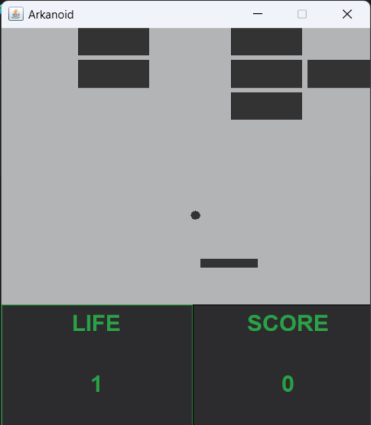
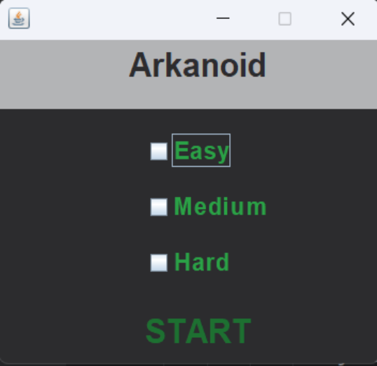

# Arkanoid
Arkanoid is a simple arcade game based on breaking blocks using a ball bounced off a platform controlled by the player.

# Instruction
- **Difficulty level selection**: At the beginning, the player chooses one of three available difficulty levels: easy, medium, hard. Depending on the choice, the player will have one, two, or three lives to lose.
  
 
 
- **Control**: The player controls the platform by moving it right or left using mouse movements.
- **Game**: The objective of the game is to break all the blocks and score as many points as possible. The player earns points for breaking blocks; for each block destroyed, they receive 10 points. However, if the ball falls to the bottom of the screen, the player loses a life and 10 points.
- **End game**: The game ends when the player breaks all the blocks or loses all lives, then the game restarts.

# Requirements
-**Java 21**: Make sure you have Java Development Kit (JDK) version 21 installed on your system. You can download and install it from the official Java website: Java SE Downloads.
-**IDE**: Install your favorite Integrated Development Environment (IDE) to be able to run the application.

# How to run
- **Clone the repository**
- **Run the MainApp.class**
